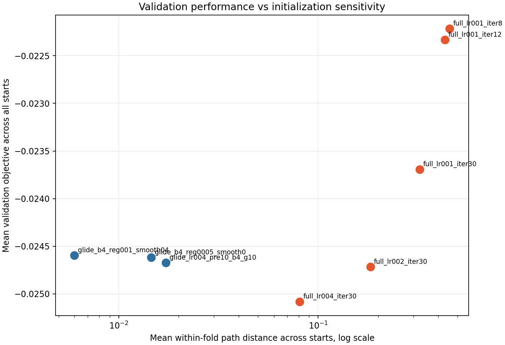
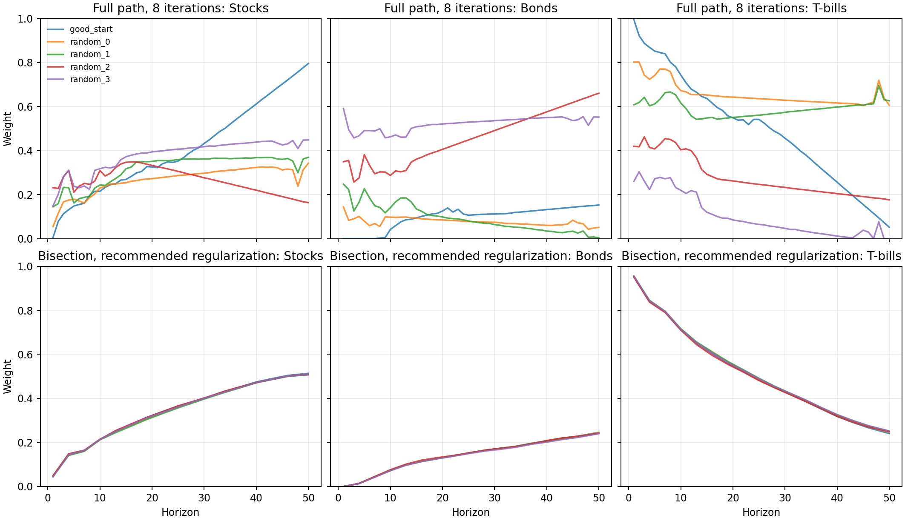
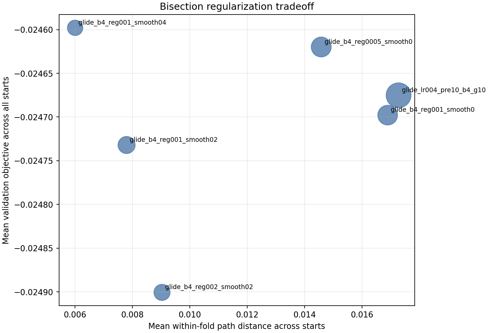

# Validation Tuning Report

This pass tuned the consolidated optimizers using 5-fold `year-cv` with 2,000 simulations per fold, a 60/40 circular contiguous year split, the good empirical endpoint start, and 4 random starts per fold. The objective values below are canonical out-of-sample validation objectives; higher is better.

## Recommendation

Use the bisection glide-path optimizer for the main product run, with:

- `learning_rate = 0.04`
- `bisections = 4`
- `gradient_steps = 10`
- `curvature_penalty = 0.001`
- `smooth = true`
- `smoothing_strength = 0.4`
- `smoothing_bandwidth = 10.0`

This is the `glide_b4_reg001_smooth04` run.

The short full-path optimizer has better validation objective in this experiment, but it is highly initialization-sensitive. Since the output of this project is not just a scalar objective but an interpretable derived glide path, I would not use full-path as the primary algorithm unless we later add stronger constraints or regularization that make the derived path stable.

## Main Evidence

The key metric I used for within-fold consistency is the mean pairwise path distance across the 5 starts in each fold, averaged across folds. Each path distance is the mean horizon-wise L2 distance across the three asset weights.

Important results:

| Experiment | Mean validation, all starts | Validation if selecting start by train objective | Within-fold path distance | Mean curvature |
|---|---:|---:|---:|---:|
| `full_lr001_iter8` | -0.022216 | -0.025800 | 0.456992 | 0.326492 |
| `full_lr001_iter12` | -0.022334 | -0.025787 | 0.433245 | 0.391184 |
| `glide_lr004_pre10_b4_g10` | -0.024675 | -0.024698 | 0.017277 | 0.245539 |
| `glide_b4_reg0005_smooth0` | -0.024620 | -0.024654 | 0.014581 | 0.150619 |
| `glide_b4_reg001_smooth04` | -0.024598 | -0.024649 | 0.006002 | 0.082686 |

The full-path algorithm still wins if we care only about average validation objective for a fixed set of starts. But the selected path varies dramatically by initialization. Worse, choosing the full-path start by training objective gives poor validation, which suggests the extra degrees of freedom are being used in ways that do not transfer reliably.

The bisection optimizer gives nearly the same validation result regardless of start. The recommended regularized setting reduces within-fold path distance by about 65% versus unregularized 4-bisection glide optimization, while keeping validation roughly unchanged.

## Learning Rate And Iterations

The initial full-path learning-rate sweep suggested that `0.01` was the best full-path learning rate. Higher learning rates pushed training objective up faster, but made validation and path curvature worse by the end of 30 iterations:

The mean validation trace for full-path peaked early, so I reran shorter versions:

- `full_lr001_iter8`: mean validation across starts `-0.022216`
- `full_lr001_iter12`: mean validation across starts `-0.022334`
- `full_lr001_iter30`: mean validation across starts `-0.023696`

That confirms that long unregularized full-path runs continue improving training performance after validation has already started to degrade. It also confirms that the short full-path algorithm is a legitimate validation baseline, not a straw version of the method.

## Algorithm Choice

The bisection algorithm is much less sensitive to initialization. In the representative fold above, the full-path starts lead to visibly different stock/bond/T-bill paths. The recommended bisection setting produces paths that are almost on top of each other within the same fold.

I consider this decisive for algorithm choice. The full-path optimizer may be useful as a diagnostic upper bound on validation objective, but the bisection optimizer is better aligned with the repository's final purpose: deriving a stable glide path that can be interpreted after the full-dataset run.

## Regularization

Regularization behaved sensibly:

- A small curvature penalty (`0.0005`) improved validation slightly and reduced curvature substantially.
- Increasing curvature penalty to `0.001` without smoothing did not improve validation or within-fold similarity.
- Adding smoothing made the path much more stable.
- `smoothing_strength = 0.4` beat `0.2` on validation and stability in this pass.
- `curvature_penalty = 0.002` with smoothing was too strong: it worsened validation without improving similarity enough to justify the cost.

The recommended setting, `curvature_penalty = 0.001` with `smoothing_strength = 0.4`, is the best balance I found: it had the lowest within-fold path distance, the lowest curvature among plausible candidates, and validation essentially tied with the best bisection regularized setting.

## Number Of Bisections

The bisection-shape sweep favored 4 bisections over 5 or 6 for this tuning goal:

| Experiment | Bisections | Mean validation, all starts | Within-fold path distance | Mean curvature |
|---|---:|---:|---:|---:|
| `glide_lr004_pre10_b4_g10` | 4 | -0.024675 | 0.017277 | 0.245539 |
| `glide_lr004_pre10_b5_g10` | 5 | -0.025120 | 0.019449 | 0.784796 |
| `glide_lr004_pre10_b6_g8` | 6 | -0.025068 | 0.021297 | 1.352898 |

More bisections add flexibility, but in this validation run that flexibility mostly showed up as higher curvature and slightly worse validation.

## Files

- Combined summary: [combined_summary.csv](report_assets/combined_summary.csv)
- Exploration results: [explore_summary.csv](runs/explore_2000/explore_summary.csv)
- Focused results: [focused_summary.csv](runs/focused_2000/focused_summary.csv)
- Reproducible tuning harness: [run_tuning.py](run_tuning.py)
- Report plot helper: [analyze_results.py](analyze_results.py)

## Caveats

This was a greedy tuning pass, not an exhaustive search. The most important unresolved question is whether a regularized full-path optimizer can keep its validation advantage while becoming path-stable. I would only pursue that if we want to keep full-path alive as a serious alternative. For now, the bisection algorithm gives a much cleaner validation-and-stability story.
