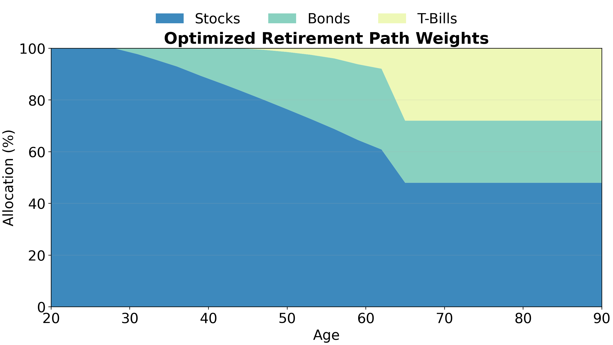
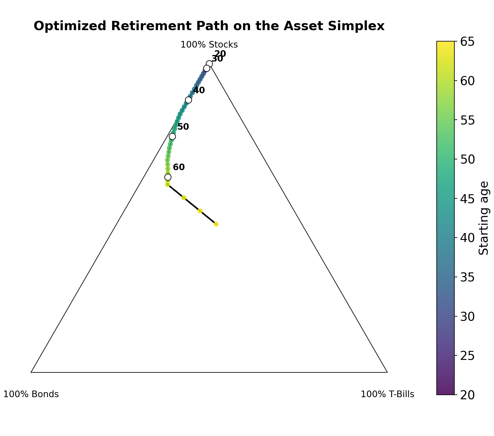
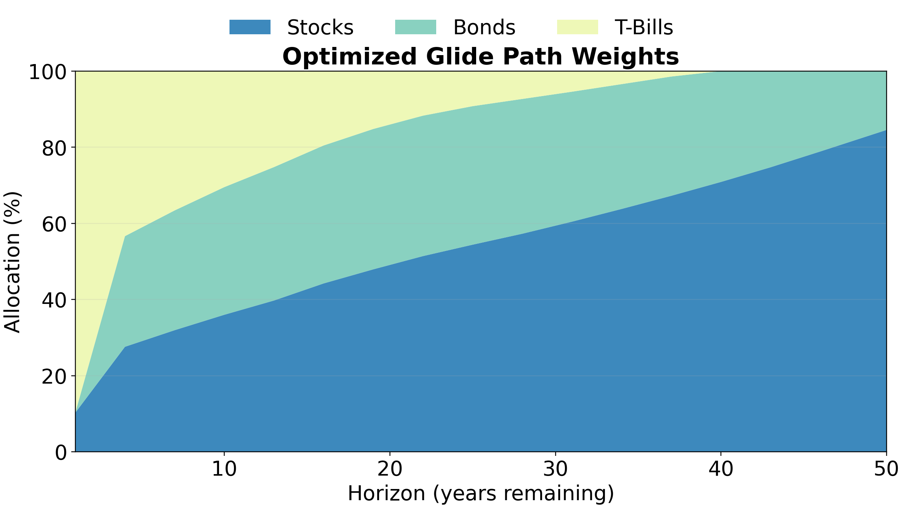
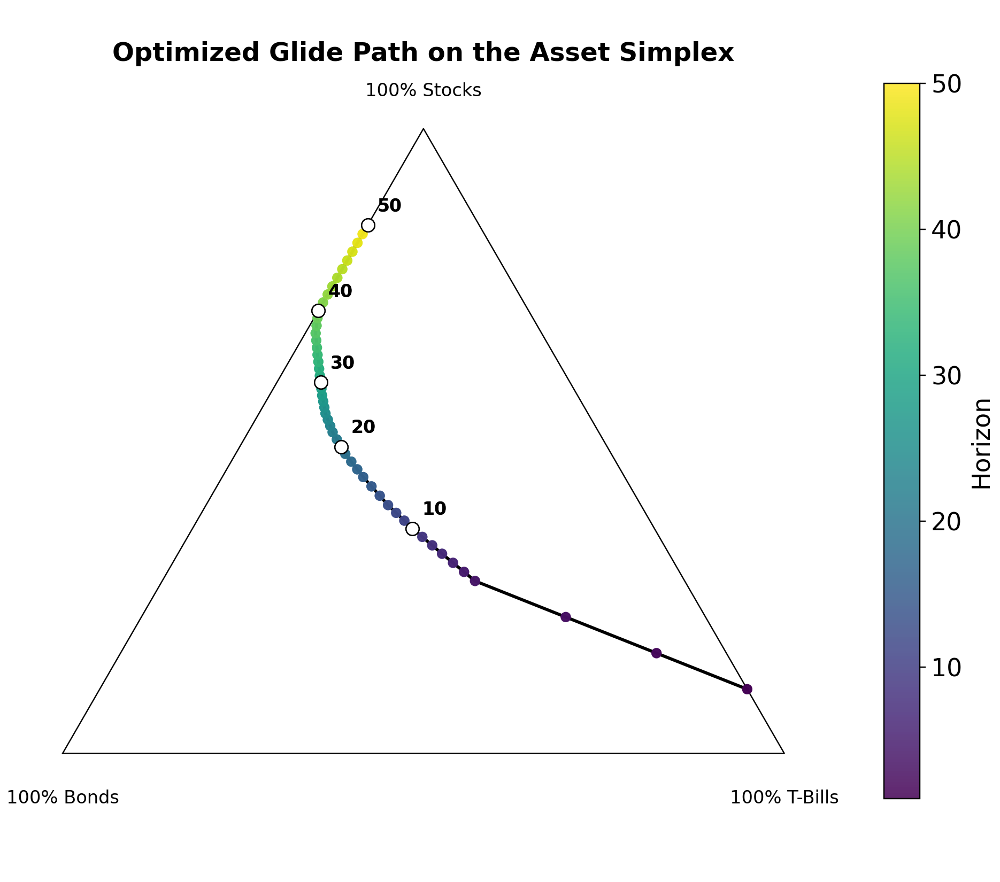

The main output of this project is a guideline (glide path) for investment strategy for retirement and non-retirement accounts.

## Retirement {#sec-retirement-results}

### Glide Path {#sec-retirement-glide-path}

::: {.panel-tabset}
## Allocation ribbon

::: {#fig-retirement-allocation}

Optimized retirement glide path weights by age.
:::

## Simplex path

::: {#fig-retirement-simplex}

The same optimized retirement path on the stock/bond/T-bill simplex.
:::
:::

An optimal glide path for retirement involves near-100% allocation into stocks through age 30.
As an investor approaches retirement, this allocation decreases, replaced primarily by bonds
until arriving at the post-retirement allocation of 48% stocks/ 24% bonds/ 28% T-bills

### Annual Withdrawals {#sec-annual-withdrawals}

The project also tested whether the standard 4% advice for withdrawals in retirement was reasonable.
Interestingly, under my assumptions, 4% was slightly too risky; around 3.5% seemed the most-aggressive
safe rate. See [Determining Annual Withdrawals](dataset_simulation.qmd#sec-determining-annual-withdrawals) for more detail.

::: {#fig-core-withdrawal-sweep}

Withdrawal-rate sweep used to choose 3.5% as the retirement modeling assumption.
:::

## Non-Retirement {#sec-non-retirement-results}

::: {.panel-tabset}
## Allocation ribbon

::: {#fig-non-retirement-allocation}

Optimized non-retirement glide path weights by investment horizon.
:::

## Simplex path

::: {#fig-non-retirement-simplex}

The same optimized non-retirement glide path on the stock/bond/T-bill simplex.
:::
:::

An investor with just a year to invest should invest roughly 10% stocks/ 90% T-bills. Longer horizons gradually trade
T-bills for intermediate-duration bonds, and gain more stock exposure. By 30 years, we're somewhat close to the famous
60/40 at 60% stocks/ 32% bonds/ 8% T-bills. At a 50-year horizon, the optimal portfolio hits about 87% stocks/ 13% bonds.
