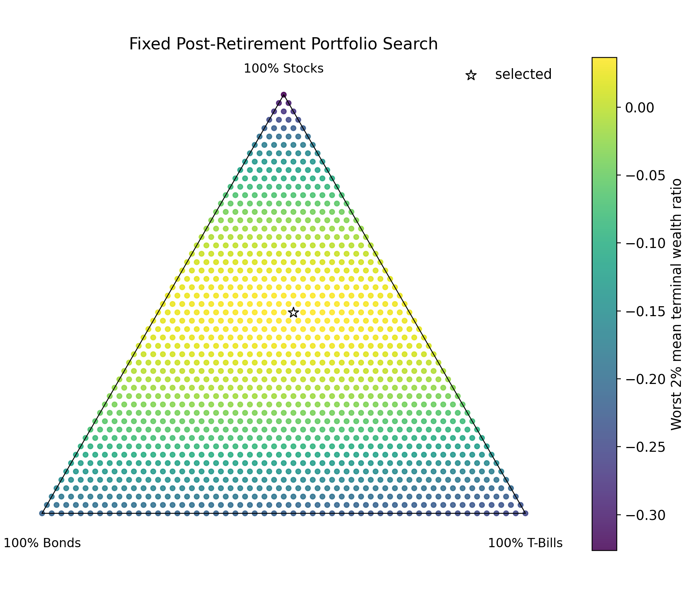
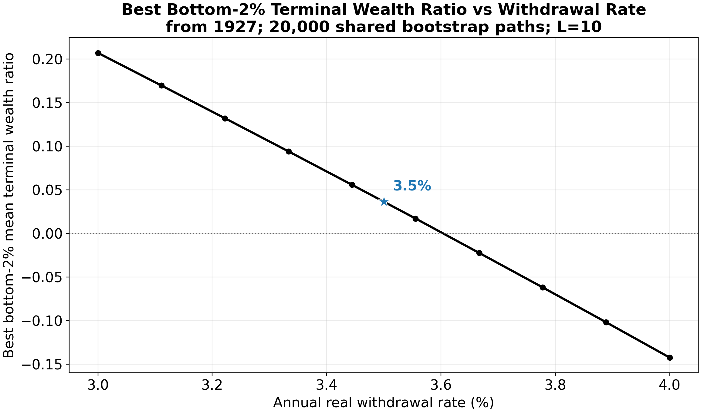

## Dataset {#sec-dataset}

This project is made possible by historical annual-returns data from [Simba's Backtesting Spreadsheet](https://www.bogleheads.org/wiki/Simba%27s_backtesting_spreadsheet). Specifically, I make use of the `Data Series` tab, and real returns from the `TSM (US)`, `TBM (US)`, and `T-Bills TR` columns. I use only the data between 1927 and 2025, as earlier data are either simulated or otherwise statistically estimated.

## Objective {#sec-objective}

### Before Age 65 {#sec-before-age-65}

#### Basic Framing {#sec-basic-framing}

To determine the best portfolio at a given age or horizon, I define an objective function and optimize it (see [optimization algorithms](optimization.qmd#sec-final-algorithm)).
For a given age or horizon before age 65, the objective is the mean annualized real returns among the worst 4% of simulated Monte Carlo outcomes along the remainder of the
glide path. While the objective is explicitly downside-aware, optimal investments still become more aggressive for longer horizons.

#### Scoring an Entire Glide Path {#sec-scoring-glide-path}

Since the product of the project is a glide path, the objective must be generalized at this level rather than at the level of an individual horizon or age. In practice, I use an exponentially weighted sum of objectives for each horizon/age:

For the non-retirement glide path, let $W = (w_1,\ldots,w_H)$ be the sequence of portfolio weights indexed by years remaining, and let

$$
s_h(W) =
\frac{1}{|T_h|}
\sum_{m \in T_h}
\left[
\prod_{t=1}^{h}
\left(1 + r_{m,t}^{\top} w_{h-t+1}\right)
\right]^{1/h}
- 1
$$

where $T_h$ is the bottom 4% of simulated outcomes for horizon $h$. The path objective is

$$
J_{\text{non-retirement}}(W)
=
\frac{1}{H}
\sum_{h=1}^{H}
\beta_h s_h(W),
\qquad
\beta_h =
\frac{
\exp\left(\log(\alpha)\frac{h-1}{H-1}\right)
}{
\frac{1}{H}\sum_{k=1}^{H}\exp\left(\log(\alpha)\frac{k-1}{H-1}\right)
}.
$$

In practice, I choose a small $\alpha$ of 0.001, which is intentionally selected so that optimization prioritizes shorter horizons. The idea is that the optimal glide path must be
*nested*: someone investing for two years should have the same portfolio in their last year as a one-year investor. In fact, as $\alpha \to 0$, optimization's maximum
perfectly approaches this nested property.

For the retirement accumulation path, each starting age has a score formed from the same worst-tail idea, but evaluated across retirement outcomes after passing through the fixed post-retirement block. Let $a$ index starting age, $U$ be the retirement evaluation ages 65 through 90, and $B_{m,u}(a,W)$ be the simulated wealth at evaluation age $u$ for simulation $m$ when starting at age $a$. Then

$$
J_{\text{retirement}}(W)
=
\frac{1}{|A|}
\sum_{a \in A}
\gamma_a
\left[
\frac{1}{|U|}
\sum_{u \in U}
\frac{1}{|T_{a,u}|}
\sum_{m \in T_{a,u}}
\max\{B_{m,u}(a,W), 0\}
\right],
$$

where $T_{a,u}$ is the bottom 4% of simulated outcomes for that starting age and evaluation age. I use an age-65/age-20 weighting ratio of 1000, which intentionally puts more pressure on near-retirement starts.

### After Age 65 {#sec-after-age-65}

Since cash flows are assumed to be fixed in retirement (annual withdrawals + constant expected gains/losses from investments), I opt to find the best fixed allocation, as
opposed to a glide path, for the post-retirement block (ages 65-90 here).

#### Main Objective {#sec-post-retirement-objective}

The best portfolio was defined as the one maximizing the mean among the worst 2% of simulated Monte Carlo returns. Why 2% instead of the 4% used in the pre-retirement and
non-retirement glide paths? My intuition for the stricter rule comes from the opinion that depleting life savings is more disastrous than achieving suboptimal returns
prior to retirement, whether in a retirement or non-retirement account. Note that constant annual withdrawals were assumed in the post-retirement block (more on this in the
next section).

::: {#fig-post-retirement-grid}

Fixed post-retirement portfolio search over the discretized stock/bond/T-bill simplex. The selected point is the allocation with the best mean terminal wealth ratio among the worst 2% of simulated outcomes.
:::

#### Determining Annual Withdrawals {#sec-determining-annual-withdrawals}

Common retirement recommendations advocate for an investor to withdraw 4% of accumulated retirement savings in a given year, adjusting the nominal amount by inflation.
This project aimed to test that 4% number using a similar framing of risk as the glide-path arm. Specifically, I required that the average among the worst 2% of outcomes
for the optimal portfolio not fully deplete retirement savings. Interestingly, the 4% rule results in bankruptcy according to this framing; a value close to 3.5% (the value
selected for modeling pre-retirement glide paths) leaves a small buffer at 90.

::: {#fig-withdrawal-sweep}

Withdrawal-rate sweep for the fixed post-retirement block. The 3.5% point remains above zero for the mean of the worst 2% of terminal wealth outcomes, while more aggressive rates cross into depletion.
:::

As a caveat to my results, I make the strict assumption that investors immediately withdraw some retirement savings at age 65; in practice, research shows typical investors
often begin withdrawing several years later.

## Simulation Strategy {#sec-simulation-strategy}

Because I only had 99 years to work with, and data are substantially autocorrelated (particularly within economic regimes), I opted to employ a form of bootstrapping.

### Circular Block Bootstrapping {#sec-circular-block-bootstrap}

To generate Monte Carlo simulations of the historical data, I use a circular block-bootstrapping algorithm. The idea is to produce novel but plausible sequences of annual-returns data, expanding the limited reference data but preserving sequential dependencies. For a given Monte Carlo run, here's the algorithm:

1. Start at a random year in the historical data.
2. With probability 1/10, move to another random year. Otherwise, proceed with the next year.

Annualized returns are evaluated for a given portfolio along the resulting series of years, with the boundary at 2025 circularly connected to the first year, 1927. This procedure is followed for each year along the investment period until horizon 50 (non-retirement) or age 90 (retirement). That probability of 1/10 produces an expected *block length* of 10, with block lengths geometrically distributed. The choice of `block_length = 10` was arbitrary and based on intuition; longer block lengths are better at preserving real relationships among data across years, but smaller block lengths offer the opportunity to essentially generate a larger (and even potentially more accurate!) synthetic dataset.

### Validation vs Final Runs {#sec-validation-final-runs}

To select optimization hyperparameters (see [optimization algorithms](optimization.qmd#sec-final-algorithm)), 2000 Monte Carlo simulations were generated for both training and validation slices of the data. For the final runs on the full data, 20,000 runs were simulated.
