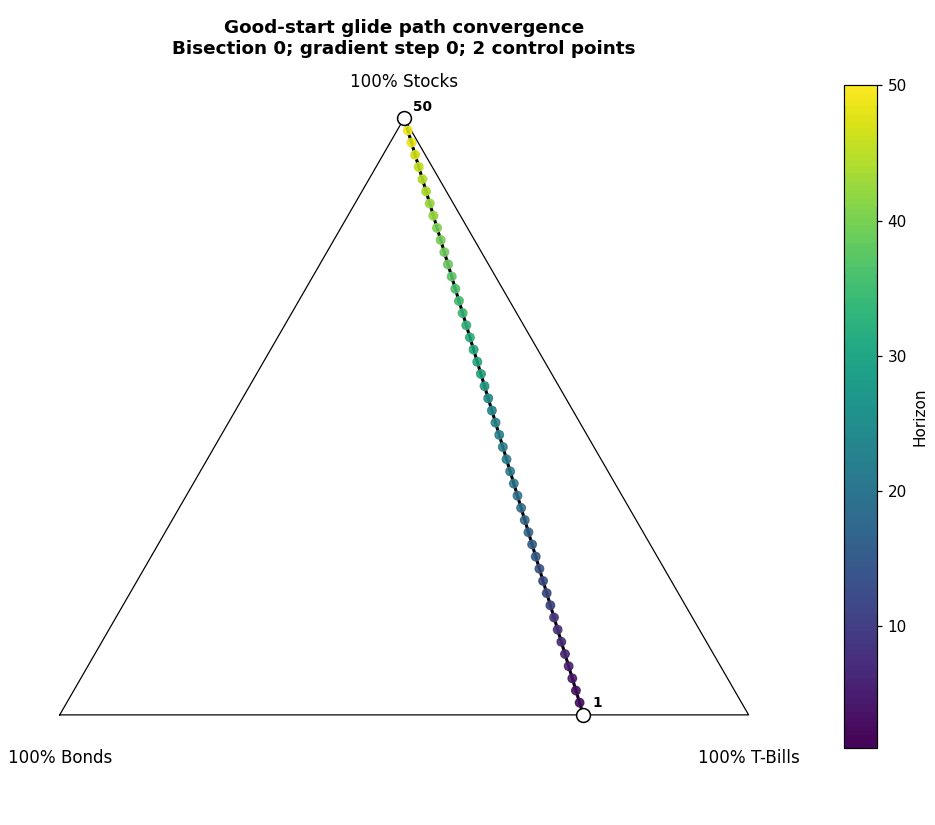

I experimented with several optimization approaches throughout the life of this project to arrive at a glide path optimizing the [objective](dataset_simulation.qmd#sec-objective). I'll
split this into the final algorithm used for results and all other algorithms attempted before arriving at the final one.

## Final Algorithm {#sec-final-algorithm}

::: {#fig-optimization-simplex}

The full-dataset, good-start, non-retirement glide path converging on the asset simplex. The colored points show horizons, while the white points show the active control points at each gradient step.
:::

I developed the algorithm to work initially in a non-retirement context, which I'll describe here; however, the algorithm is generalizable to any glide path, including the
retirement context.

### Gradient Ascent {#sec-gradient-ascent}

In the non-retirement context, a glide path is composed of weights for stocks, bonds, and treasuries at each horizon from 1 to 50. Mathematically, we can call this a
3 x 50 matrix. The returns along Monte Carlo simulated trajectories are a direct function of this matrix. In fact, the [objective](dataset_simulation.qmd#sec-objective) is a fixed function
of this matrix that is differentiable *almost everywhere* (except at points along the surface where certain simulated paths transition in or out of the worst 4% of outcomes).
The fact that the objective is locally differentiable with respect to the weights means we can apply gradient ascent to a starting glide path and iteratively improve the
objective while refining the glide path.

In testing, it turns out that the final path after applying many iterations of gradient ascent is highly sensitive to the initial glide path, which is perhaps expected of a
non-convex optimization surface. However, I wanted an algorithm that was robust to initial conditions.

### Gradient Ascent with Path Bisections {#sec-gradient-ascent-bisections}

The intuition for this algorithm variation is to gradually increase the complexity of the path being optimized as it gets closer to convergence. At each main iteration of the
algorithm, there are $N_i = 2^i + 1$ equally spaced control points, between which portfolio weights are linearly interpolated. Whenever gradient ascent is applied, it operates only
on these control points; the gradient tracks changes to the objective both due to movement of the control points and due to changes in the positions of the linearly
interpolated points. In this way, the whole path has fewer tunable parameters throughout most of the optimization process, but the entire glide path contributes accurately to
the objective. The algorithm works like this:

1. Start with 2 control points: the portfolio weights for horizon 1 and 50. These can be randomly selected or empirically selected (more on this later).
2. Apply 15 iterations of gradient ascent, moving those 2 endpoints.

For bisection $i \in \{1,2,3,4\}$:

1. Add new control points at the midpoint of every pair of adjacent existing control points.
2. Apply 15 more iterations of gradient ascent on these control points.

As hypothesized, this algorithm is insensitive to random initialization: seemingly all initial glide paths tested converged to the same final result.

### Regularization {#sec-regularization}

In practice, additional regularization improved both validation performance and consistency of
final paths across validation folds (details in [this vignette](why_trust.qmd#sec-hyperparameter-tuning)). Both convex
smoothing and a Huber curvature penalty together resulted in this improvement; these
regularization approaches were intended to reduce jaggedness and complexity in the optimized
paths.

## Other Attempted Algorithms {#sec-other-algorithms}

Earlier versions included fixed-portfolio grids, greedy one-horizon-at-a-time paths, and direct full-path gradient ascent. The direct full-path optimizer was useful as a validation baseline, but it was much more sensitive to initialization than the bisection/control-point optimizer. That made it a worse fit for the main project goal: producing a stable, interpretable glide path rather than merely a high-scoring path from a lucky start.
