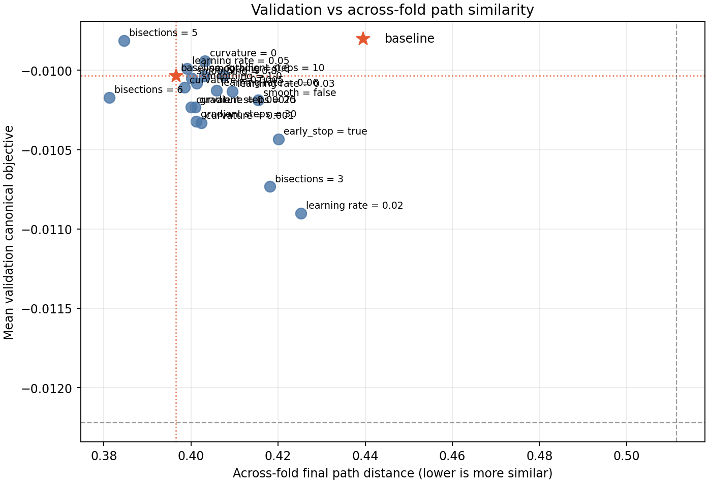
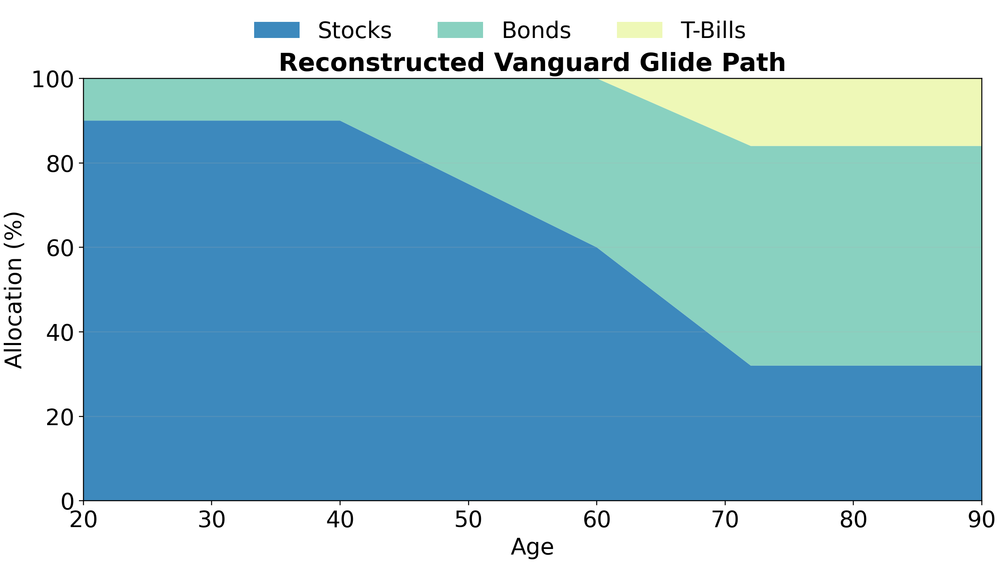
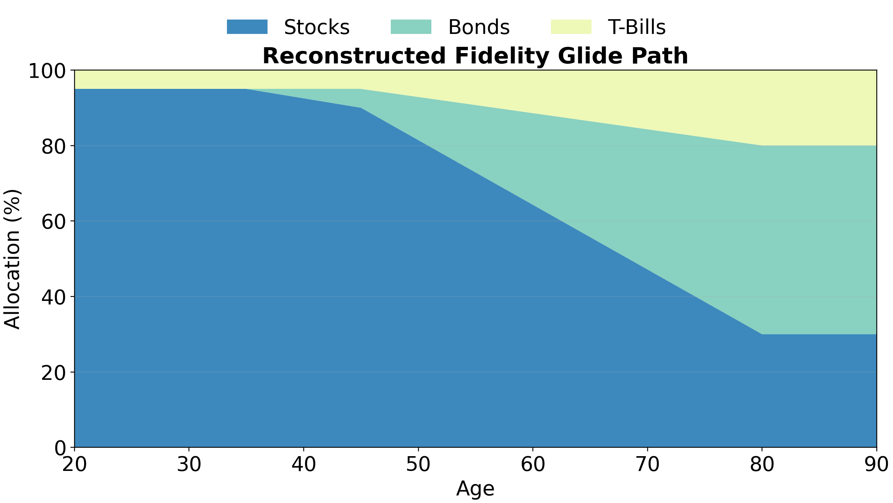
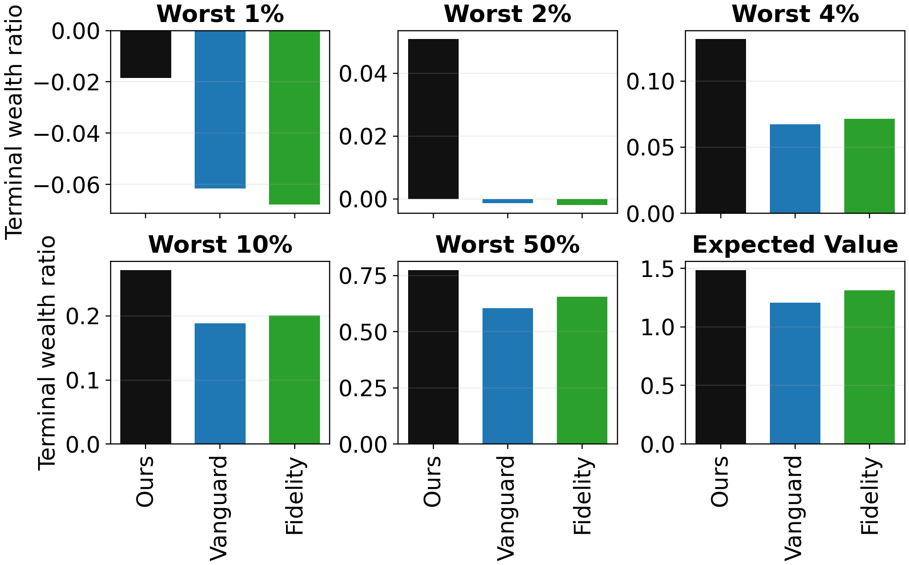
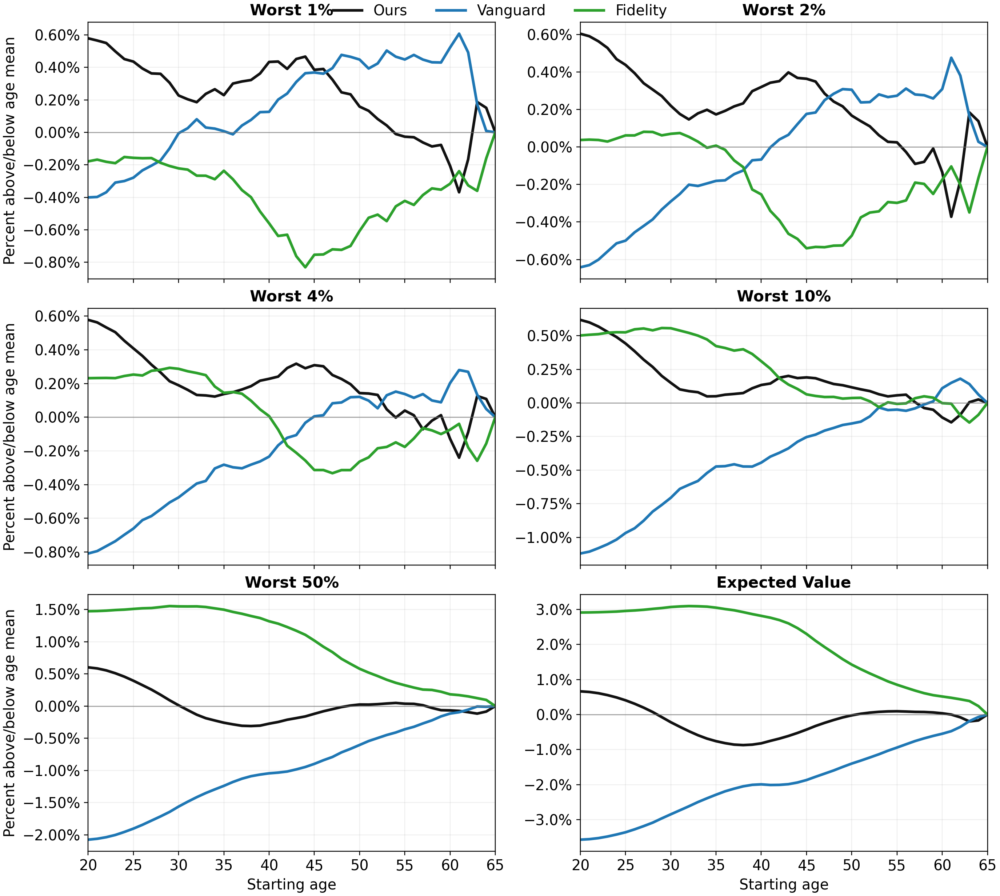

I used a combination of standard machine-learning best practices and validation against
external data to ensure the results found by this project were robust and trustworthy.

## Machine Learning Approach {#sec-machine-learning-approach}

The ~100-year dataset is fairly small, and I had to try different
[optimization algorithms](optimization.qmd) and hyperparameters before arriving at an
effective strategy. The basic idea was to treat the glide path as a machine learning
model, and employ standard best practices.

### Cross Validation {#sec-cross-validation}

The small ~100-year dataset with temporally autocorrelated observations presented
challenges for employing standard k-fold cross validation. A naive initial approach would be
to split time periods into 5 training and validation folds; however, this leaves just 20
years for validation in each fold. Economic regimes can vary dramatically between periods
this small, and the optimal strategy may not be expected to generalize from training to
validation with this approach.

I employed a modified 5-fold cross validation where training/validation was split 60/40.
These sets could partially overlap against folds; the first year for each training chunk
was linearly sampled from the full ~100-year dataset, and 2025 was circularly connected to
1927 when forming the chunks. While variation across folds is somewhat artifically reduced
compared to standard k-fold cross validation, this approach makes better use of the limited
number of total years, and validation sets are sufficiently large.

### Hyperparameter Tuning {#sec-hyperparameter-tuning}

There were quite a few hyperparameters to tune:

- optimization algorithm
- number of bisections
- learning rate
- number of gradient steps
- convex-smoothing strength
- Huber curvature penalty

A full grid search was too expensive; I opted to greedily tune each parameter individually.
After arriving in a good range, I verified that perturbations of any hyperparameter
resulted in worse scores for validation performance or similarity of optimized paths across
folds:

::: {#fig-hyperparameter-screen}

Hyperparameter perturbation screen, comparing validation performance against similarity of optimized paths across folds.
:::

## Validation of Retirement Paths {#sec-retirement-validation}

Due to the tiny size of the historical dataset, my machine learning approach employed a
training and validation set, but no final test set. Instead, after fixing hyperparameters
selected from validation, I tested the optimization algorithm on the retirement branch of
the project, and compared performance against target-date glide paths publicly described by
[Vanguard](https://workplace.vanguard.com/investment/strategies/tdf-glide-path.html)
and [Fidelity](https://institutional.fidelity.com/app/proxy/content?literatureURL=/9921209.PDF).

::: {.panel-tabset}
## My optimized path

## Vanguard approximation

## Fidelity approximation

:::

As a caveat, both Vanguard and Fidelity place assets in their glide paths that don't fit
perfectly in my 3 categories; for example, non-US equities were approximated as US equities
for the purposes of my simulations, and TIPS were considered short-duration treasuries. In
general, this could lead to underrepresenting the true portfolio performance of their funds
in my comparison. However, their glide paths still serve as a useful approximate validation
tool for my optimization approach.

I separated compared post-retirement outcomes and pre-retirement outcomes.

### Post-Retirement Outcomes {#sec-post-retirement-outcomes}

After optimization, my glide path performs better at every tested definition of risk. Here
I consider the proportion of initial (age-65) wealth left at age 90 (y-axis) among the
worst N% of simulated outcomes.

::: {#fig-post-retirement-external-comparison}

Post-retirement external comparison across downside-risk definitions.
:::

### Pre-Retirement Outcomes {#sec-pre-retirement-outcomes}

My optimal portfolio appeared favorable or comparable to Fidelity or Vanguard's in
pre-retirement as well. Here I show each approach's performance relative to the mean on the
y-axis. At a given age, I essentially calculate a ratio of terminal wealth to starting wealth
among the worst N% of simulations (see the [retirement accumulation objective](dataset_simulation.qmd#sec-scoring-glide-path)).
At more conservative definitions of risk, my portfolio performs favorably (recall it optimizes
for worst 4%), while Fidelity outperforms it in typical returns.

::: {#fig-pre-retirement-external-comparison}

Pre-retirement external comparison against Vanguard and Fidelity approximations, shown relative to the same-age mean.
:::
